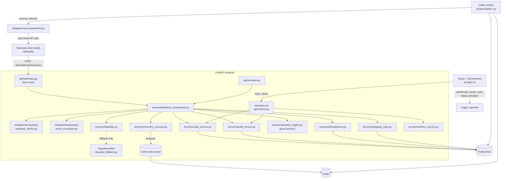
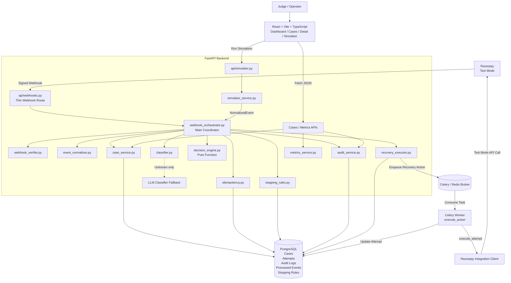

# ARCHITECTURE.md

## Overview

// 

## Responsibilities

**Frontend (`frontend/`)** — a client-side React + Vite + TypeScript SPA. Renders the dashboard, case list, case detail, and simulator controls. Talks to the backend exclusively through `frontend/src/api/*.ts` (no scattered `fetch()` calls in components). Holds zero secrets — only `VITE_API_BASE_URL`.

**FastAPI (`backend/app/api/`, `backend/app/main.py`)** — thin HTTP layer. Routes parse/validate the request (Pydantic schemas), call exactly one service function, and serialize the response. No business logic lives in a route handler — see `app/api/webhooks.py` for the pattern: read raw bytes, hand off to `webhook_orchestrator`, return its result.

**Database (`backend/app/models/`, Postgres via `backend/alembic/`)** — the persistent record of cases, attempts, audit entries, processed webhook events, and stopping-rule configuration. SQLAlchemy models; Alembic migrations (hand-written, see `alembic/versions/0001_initial_schema.py`) are the source of truth for the schema, not `Base.metadata.create_all()` in production use (tests use `create_all()` against SQLite for speed — see `backend/tests/conftest.py`).

**Celery/Redis (`backend/app/workers/`)** — runs work that shouldn't block a webhook response: executing a scheduled recovery action against Razorpay (`workers/tasks/execute_action.py`). Tasks receive IDs, not ORM objects, and load what they need from the DB themselves. `workers/tasks/process_webhook.py` exists as an async entry point into the same orchestrator but isn't wired into the live request path yet (see AGENTS.md / PROJECT_STATUS.md for why). `workers/tasks/stale_case_check.py` is a registered placeholder for a periodic sweep.

**Razorpay integration boundary (`backend/app/integrations/razorpay/`)** — the only place the `razorpay` SDK is imported. `webhook_verifier.py` checks the HMAC signature; `event_normalizer.py` turns a raw payload into a `NormalizedEvent`; `client.py` wraps outbound calls (retry a charge, create a payment-update link, notify a customer) — currently stubbed with `TODO(AG)` markers since no live Razorpay test account is wired into this repo yet.

**Classifier (`backend/app/services/classifier.py`)** — deterministic failure-code → `FailureCategory` mapping, checked first. Falls back to `integrations/llm/classifier_fallback.py` (currently an interface + stub, always returns `unknown`) only when the deterministic map doesn't recognize the code.

**Decision engine (`backend/app/services/decision_engine.py`)** — pure function: `DecisionContext` in, `Decision` out. Implements the PRD's category → action mapping (retriable_technical → retry in 2h, card_issue → payment-update link, insufficient_funds → retry in 24h, customer_action_needed → notify, unknown → escalate) plus an unconditional stopping-rule-triggered → halt branch. No I/O, no side effects — fully unit-testable (see `backend/tests/test_decision_contract.py`).

**Stopping rules (`backend/app/services/stopping_rules.py`)** — loads the configured `StoppingRuleConfig` for a failure category (or Settings defaults if unseeded) and evaluates opt-out, max-retries, and max-days-open. Runs before the decision engine so a triggered rule can force a halt regardless of category.

**Recovery executor (`backend/app/services/recovery_executor.py`)** — turns a `Decision` into a `RecoveryAttempt` row, applies the resulting status to the case, and either marks the attempt `SKIPPED` (no external action needed) or enqueues `execute_action` (immediately or at `decision.execute_at`). The actual Razorpay call happens inside `execute_attempt`, invoked by the Celery task — never inline in the request path. If the broker is unreachable, the enqueue failure is caught and audited rather than crashing the caller; the attempt stays `PENDING` (see the `TODO(AG)` there about a reconciliation sweep).

**Audit logging (`backend/app/services/audit_service.py`)** — the single write path for `AuditLog` rows. Every stage of the pipeline calls `record_event(...)` with a `case_id` (nullable for pre-case events like a rejected signature), an `AuditEventType`, an `AuditActor`, and a human-readable description.

**Simulator (`backend/app/services/simulator_service.py`)** — generates synthetic `NormalizedEvent`s tagged `EventSource.SIMULATOR` across a realistic mix of failure codes, then calls `webhook_orchestrator.process_event` — the exact same function real webhooks use.

**Metrics/dashboard flow (`backend/app/services/metrics_service.py` → `api/metrics.py` → `frontend/src/pages/DashboardPage.tsx`)** — aggregates case counts and amounts in Python (fine at demo scale; flagged as a `TODO(AG)` to move to SQL aggregation later) and serves them as `MetricsResponse`, consumed by the dashboard's metric cards.

## Notable architecture decisions

- **Webhook processing is currently synchronous inside the FastAPI request**, not queued through Celery on the ingestion side, even though the PRD diagram shows an event queue. Everything in the orchestrator pipeline is bounded DB writes (the one external call — Razorpay execution — is already deferred to Celery via `recovery_executor`), so this is fast enough for demo/hackathon scale. `workers/tasks/process_webhook.py` exists so switching to fully-async ingestion is a one-line change in `api/webhooks.py` — see that file's docstring.
- **IDs are string UUIDs, not native Postgres UUID/enum types.** This keeps every model usable unmodified against SQLite in tests and Postgres in dev/prod, and keeps enum-value migrations (adding a new `CaseStatus`, say) a plain `VARCHAR` change instead of a Postgres `ALTER TYPE`.
- **The decision engine ships with a real (not fake) minimal strategy**, implementing the PRD's Section 6.1 mapping directly, rather than a no-op placeholder — so the pipeline is genuinely functional end-to-end out of the box. Retry-interval tuning and payday-aware timing are left as `TODO(AG)`s.
